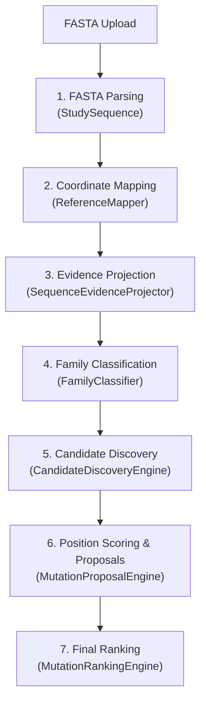

# Hotspot Prioritization V2: Signal Audit & Architecture Design

**Date**: 2026-08-31
**Status**: Audit & Design Phase (Phase 5)

This document audits the available evolutionary, biochemical, and structural signals in the PETase Engineering Atlas, traces the current FASTA execution pipeline, identifies missing features, and proposes candidate architectures for Hotspot Prioritization V2.

---

## 1. Audit of Current Hotspot Signals (Task 1)

We inspected the repository and verified which residue/position-level features are currently present in the codebase and databases:

### Evolutionary Signals
* **FVI (Family Variability Index)**: Available in the master table (`atlas_v3_master_position_table.tsv`), ranging from 1 to 7. It measures consensus variability across families.
* **Global Conservation**: Available in the master table (0% to 100%).
* **Consensus Residues**: Available in the master table as a comma-separated list of consensus amino acids.
* **Different Family Consensus**: Count of unique consensus residues across families. Available in the master table as `Different_family_consensus` (range: 1-7). **This is currently loaded but unused in position prioritization.**
* **Amino Acid Frequencies (Counts)**: Available in `atlas_v3_IsPETase_reference_table.tsv` and `pet_family_conservation_mapped_IsPETase.tsv` as a colon-separated frequency string (e.g., `A:5,G:11,...`). **This is currently available but unused.**
* **Variability Between Families / Conservation Within Families**: Family-specific consensus columns (e.g., `LCC-like_consensus`, `Thermobifida-like_consensus`) are present in the master table, allowing family-level comparison.

### Sequence / Biochemical Signals
* **WT Amino Acid Identity**: Available via sequence alignment mapping.
* **Normalized Position**: Available via the pairwise sequence alignment coordinates.
* **Biochemical Heuristics**: Chemical class change and conservative substitution logic are implemented in `MutationProposal.chemical_change()`, but this is only applied at the downstream *mutation* level, not the upstream *position* level.
* **Residue Neighborhood / Motifs**: No sequence-neighborhood features or motif-membership annotations are currently computed.

### Structural Signals
* **Status**: **Completely Absent**. The `structures` directory is empty. There are no structural databases, SASA tables, secondary structure maps, catalytic distances, or pocket proximity tables in the active codebase. 
* **Mapping code**: The codebase contains UI components (`structure_viewer_panel.py` and `structural_residue_mapping.py`) that map query positions to PDB chain/residue numbers for display, but no physical structural features (SASA, flex, pocket distance) are stored or scored.

### Literature Signals
* **Mutation Evidence / Known Mutations**: Available in `atlas_v3_master_position_table.tsv` and `known_mutations_atlas_v3.tsv`. **These are literature-leakage signals and must be excluded from the proposed independent evolutionary-structural score.**

### Model-Based Signals
* **Status**: **Completely Absent**. There are no ESM-2 log-likelihoods, protein language model embeddings, or $\Delta\Delta G$ predictions (Rosetta/FoldX) stored in the codebase or databases.

---

## 2. Trace of FASTA to Position Ranking (Task 2)

The execution flow of a uploaded FASTA sequence through the sequence-specific prioritizer is mapped below:

### Pipeline Trace Details
1. **FASTA Parsing**:
   * *File*: [study_sequence.py](file:///C:/Bioinformatics/PETase_Engineering_Atlas_Development/PETase_Evolution/engine/study_sequence.py)
   * *Class/Function*: `StudySequence.from_fasta()`
   * *Features*: Raw sequence string, sequence length, header, and validation warnings.
   * *Scope*: Sequence-specific.
   * *Hotspot Contribution*: Defines the query residue identity and length bounds.
2. **Coordinate Mapping**:
   * *File*: [reference_mapper.py](file:///C:/Bioinformatics/PETase_Engineering_Atlas_Development/PETase_Evolution/engine/reference_mapper.py)
   * *Class/Function*: `ReferenceMapper.map_sequence()`
   * *Features*: Pairwise sequence alignment coordinates, identity percent, alignment score, insertions, deletions.
   * *Scope*: Sequence-specific alignment.
   * *Hotspot Contribution*: Maps query residues to reference IsPETase coordinates.
3. **Evidence Projection**:
   * *File*: [sequence_evidence_projector.py](file:///C:/Bioinformatics/PETase_Engineering_Atlas_Development/PETase_Evolution/engine/sequence_evidence_projector.py)
   * *Class/Function*: `SequenceEvidenceProjector.project()`
   * *Features*: Projects reference IsPETase features (`fvi`, `global_conservation`, `global_consensus`, `consensus_residues`, `known_mutations`, `mutation_evidence`) onto query residues.
   * *Scope*: Reference-level features mapped to query coordinates.
   * *Hotspot Contribution*: Provides baseline evolutionary signals.
4. **Family Classification**:
   * *File*: [family_classifier.py](file:///C:/Bioinformatics/PETase_Engineering_Atlas_Development/PETase_Evolution/engine/family_classifier.py)
   * *Class/Function*: `FamilyClassifier.classify()`
   * *Features*: `predicted_family`, `confidence_status`, best score, second best score.
   * *Scope*: Sequence-specific classification.
   * *Hotspot Contribution*: Determines family assignment (e.g. LCC-like) to pull relevant family consensus proposals.
5. **Candidate Discovery / Filtering**:
   * *File*: [candidate_discovery.py](file:///C:/Bioinformatics/PETase_Engineering_Atlas_Development/PETase_Evolution/engine/candidate_discovery.py)
   * *Class/Function*: `CandidateDiscoveryEngine.get_positions()`
   * *Features*: Excludes catalytic triad and FVI < threshold.
   * *Scope*: Reference-level rules.
   * *Hotspot Contribution*: Restricts candidate pool to eligible positions.
6. **Position Scoring & Mutation Proposals**:
   * *Files*: [mutation_proposal_engine.py](file:///C:/Bioinformatics/PETase_Engineering_Atlas_Development/PETase_Evolution/engine/mutation_proposal_engine.py), [proposal_scoring.py](file:///C:/Bioinformatics/PETase_Engineering_Atlas_Development/PETase_Evolution/engine/proposal_scoring.py)
   * *Class/Function*: `MutationProposalEngine.generate_for_residue()`, `ProposalScoringEngine.score()`
   * *Features*: Generates consensus proposals, scores them using chemical changes and family support.
   * *Scope*: Mixed reference-level and proposal-level features.
   * *Hotspot Contribution*: Proposes target substitutions per position.
7. **Final Ranking**:
   * *File*: [mutation_ranking.py](file:///C:/Bioinformatics/PETase_Engineering_Atlas_Development/PETase_Evolution/engine/mutation_ranking.py)
   * *Class/Function*: `MutationRankingEngine.rank_by_position()`
   * *Features*: Sorts recommended mutations by proposal score.
   * *Scope*: Pipeline final ranking.
   * *Hotspot Contribution*: Outputs the final ranked list of prioritized positions for the user.

---

## 3. Identification of Missing Signals (Task 3)

We categorized key hotspot features based on their current availability:

### A. Already Available and Unused
* **Different Family Consensus**: High counts indicate positions with distinct family-specific consensus amino acids, highlighting functional divergence.
* **Empirical Amino Acid Counts**: The Raw Counts string (`A:5,G:11,...`) can be parsed to calculate **Shannon entropy** at each reference position, providing a continuous conservation metric instead of thresholded categories.

### B. Available but Only Indirectly
* **Family Consensus Match / Mismatch**: Comparing the query WT residue directly against its predicted family-specific consensus (e.g. LCC-like) to detect when the query residue deviates from its family consensus.

### C. Absent but Straightforward to Compute
* **Evolutionary Neighborhood Window**: Computing rolling-window averages of FVI and conservation (e.g., window size $\pm 3$) to identify highly variable surface loops versus rigid secondary structures.
* **Sequence-based delta metrics**: Basic biophysical changes (hydrophobicity delta, charge delta, molecular weight delta) for family-specific proposals.

### D. Absent and Requiring External Software/Model/Data
* **Structural Context**: SASA (solvent accessibility), secondary structure, residue depth, and distance to catalytic residues/pocket. (Requires PDB crystal structure or AlphaFold prediction, parsed via `biopython` or `dssp`).
* **Zero-Shot Language Models**: ESM-2 likelihoods and log-likelihood ratios ($\Delta LL$).

---

## 4. Proposed Hotspot V2 Architectures (Task 4)

We propose three candidate architectures:

### Architecture A: Minimal / Fast (Evolution-Only)
* **Inputs**: Query FASTA.
* **Features**: FVI, global conservation, Different Family Consensus, calculated Shannon site entropy, family-specific consensus mismatch.
* **Scoring Strategy**: Pure heuristic scoring combining FVI and Shannon site entropy, with bonus points for family consensus mismatch.
* **Interpretability**: Very High (standard sequence conservation metrics).
* **Implementation Effort**: Low (2-3 days, uses only existing files).
* **Scientific Strength**: Moderate.
* **Overfitting Risk**: Low.
* **FASTA Compatibility**: 100% (instantaneous execution).
* **Structure Prediction**: Not required.

### Architecture B: Evolution + Structure (Recommended)
* **Inputs**: Query FASTA + Reference structure PDB (IsPETase canonical crystal structure: PDB 6EQE).
* **Features**: Architecture A features + SASA, catalytic distance, pocket distance, and residue depth pre-computed on PDB 6EQE.
* **Scoring Strategy**: Evolutionary score scaled by structural factors. High variability positions near the active-site pocket are prioritized; buried core positions are filtered or penalized; distant variable surface loops are de-prioritized.
* **Interpretability**: Very High (combines phylogenetic conservation with clear biophysical and proximity arguments).
* **Implementation Effort**: Medium (requires pre-calculating structural parameters on PDB 6EQE using Biopython, storing them in a reference table, and projecting them to the query sequence).
* **Scientific Strength**: High (directly addresses the weakness of variable surface loop false-positives).
* **Overfitting Risk**: Low (physically grounded heuristics).
* **FASTA Compatibility**: 100% (the structural features of the reference positions are pre-calculated and projected using the existing coordinate mapper, meaning no runtime structure prediction is needed for the user).
* **Structure Prediction**: Not required.

### Architecture C: Evolution + Structure + Protein Language Model
* **Inputs**: Query FASTA + AlphaFold structure + ESM-2 API/inference engine.
* **Features**: Architecture B features + ESM-2 zero-shot mutational log-likelihood ratios ($\Delta LL$).
* **Scoring Strategy**: Meta-scoring model or machine learning classifier combining evolutionary, structural, and language model scores.
* **Interpretability**: Moderate (ESM-2 scores act as black-box signals, though structural metrics remain clear).
* **Implementation Effort**: High (requires PyTorch/transformers setup, ESM-2 inference integration, and structure prediction if AlphaFold structures are generated on-the-fly).
* **Scientific Strength**: Very High.
* **Overfitting Risk**: Moderate (large language models may have seen homologous sequences during pre-training).
* **FASTA Compatibility**: Low/Medium (adds heavy computational overhead).
* **Structure Prediction**: Recommended.

---

## 5. Recommended V2 Development Path (Task 5)

We recommend implementing **Architecture B (Evolution + Reference Structure)** first.

### Why Architecture B is the optimal first step:
1. **Pre-computability**: Because the Atlas maps every input sequence to IsPETase reference coordinates, we do not need structure prediction at runtime. We can pre-calculate SASA, catalytic distances, pocket proximity, and residue depth for the 290 reference positions using the high-resolution IsPETase crystal structure (PDB: 6EQE) once, and save it as a reference table.
2. **Instant FASTA Workflow**: When a user uploads a FASTA sequence, the coordinate mapper aligns it, and the projector projects these pre-computed structural features along with the FVI/conservation data. The pipeline remains FASTA-only, runs in milliseconds, and requires zero external dependencies (no PyTorch, no structure prediction tools).
3. **High Scientific Impact**: It filters out the major false positive source—highly variable surface residues far from the catalytic site—while prioritizing variable active-site pocket residues.

---

## 6. Validation Design (Task 6)

### Why the 21 strict hotspots are development-only
The 21 strict beneficial positions have been extensively reviewed and analyzed during Phase 3 and Phase 4. Using them to optimize or evaluate the weights of V2 would cause model leakage and overfit.

### Recommended Validation Strategy: Leave-One-Scaffold-Out (LOSO) Cross-Validation
Our literature dataset contains beneficial mutations from four distinct scaffold categories: IsPETase, DuraPETase, LCC, and LCC-ICCG. We recommend validating Hotspot V2 using a **Leave-One-Scaffold-Out** partition:
* **Split 1**: Train/optimize weights on IsPETase and DuraPETase hotspots; validate on LCC hotspots.
* **Split 2**: Train/optimize weights on LCC and LCC-ICCG hotspots; validate on IsPETase/DuraPETase hotspots.

LCC and IsPETase are phylogenetically distant. Success in recovering LCC hotspots using weights optimized on IsPETase proves that the combined evolutionary-structural model is generalizable across divergent sequence backbones.

---

## 7. Development Path: Files to Add/Modify

* **Files to Add**:
  - `engine/structural_features.py`: Loads the pre-computed PDB 6EQE structural features (SASA, pocket distance, depth).
  - `scripts/precompute_structural_features.py`: Scratch script to calculate residue metrics from PDB 6EQE.
  - `results/validation/hotspot_v2/6eqe_structural_features.tsv`: Pre-computed structural values.
* **Files to Modify**:
  - `engine/evidence.py`: Update `get_position_evidence()` to load and return structural features.
  - `engine/ranking.py`: Update `calculate_atlas_evidence_score()` to incorporate structural weighting.
